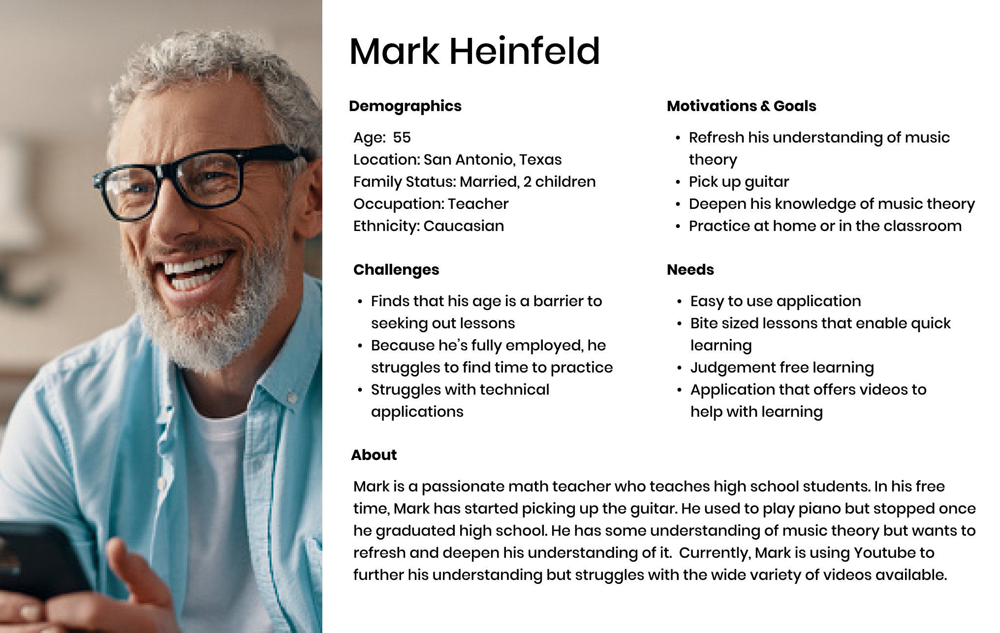
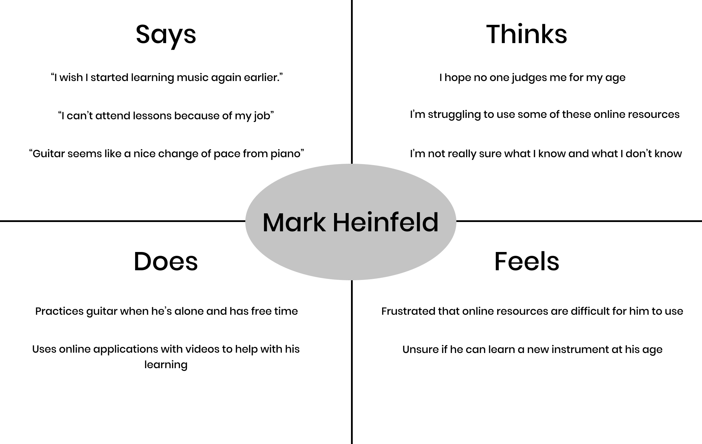
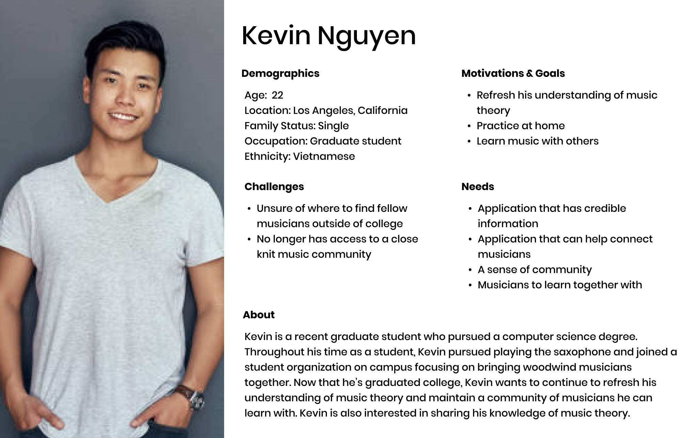

# Persona + Scenario

# Purpose of UX storytelling
UX storytelling is the next step after completing design research to better understand user needs and desires for your product. Using the information that you gathered, you can tell stories about your users, such as their backgrounds and unique needs. Storytelling helps designers to relate to their target audience throughout the design process and helps focus the product on users and improve their experiences. 

# Personas

# Scenarios

## Mark’s Scenario
### Context

As a father of two and a full time math teacher, Mark has always been strapped for time. However, lately he has been wanting to take time for himself and learn guitar. Despite having piano experience while he was in grade school, Mark has decided to learn a new instrument since the guitar is much smaller to fit in his home. In addition, a guitar is much easier to transport throughout his home in case he needs to move around to find a quiet location to practice. In his home of 4 people, Mark does find that he needs to frequently move from room to room to get some privacy. While learning piano in grade school, Mark has also collected a fair amount of knowledge in music theory. However, it has been a while since Mark has used this knowledge and wants to brush up on it as he learns guitar. Due to his job and commitment as a father, Mark cannot attend in-person lessons and needs to be able to learn at his own pace. Furthermore, he isn’t very comfortable attending in-person lectures because he feels that he will be judged for being a beginner as an older man. In order to make music learning work for him, Mark has been using Youtube because he is familiar with using videos and he can pause lessons whenever. However, he finds that the sheer variety of videos to choose from are very overwhelming. He also prefers videos as a visual and auditory learner; he finds that simply reading words on a screen doesn’t help him connect musical concepts very easily. His ideal learning experience would be a simple, easy-to-use platform that offers video resources in an orderly fashion so Mark can choose what aspect of music theory he needs to brush up his knowledge on. Mark also wants to be able to confidently know whether or not he’s mastered a lesson with a quiz that tests his knowledge after every lesson. 

## Design Feature 1: Comprehensive Lesson Tracks With Videos
## Design Feature 2: Application Navigation Tutorial
The application navigation tutorial would allow first time users to understand how to navigate and interact with lessons and quizzes. This would allow users who are less technologically proficient to easily use the application. Furthermore, lessons will include a video lesson that has a person explain the basics of the topic as if the person were attending an in-person lesson. The lesson would then lead into an optional quiz that lets users easily test themselves on what they just learned. Users can pause or continue the lesson at any time.

## Use Cases 
Mark enters the application and is greeted by an optional tutorial that guides him through how the webpage works, where lessons can be found, and how to interact with the lessons. Mark chooses to continue with the tutorial and learns the basics of how to navigate the page. He then navigates to the page where lessons are found, scrolls through the list to find a topic he is particularly interested in, and clicks on a lesson. There he is greeted by a video that he can pause or continue at any time, an option to move onto a quiz, or move onto the next lesson. Once he finishes his lesson, Mark is encouraged to take the quiz. He clicks the “take the quiz” option and is directed to a quiz that he can take as much time as he wants to complete. Once completing the quiz, Mark receives his score and is directed to move onto the next lesson. In case Mark wants to try another lesson, he is free to navigate to the lessons page and access any of the lessons in any order that he wants. 

