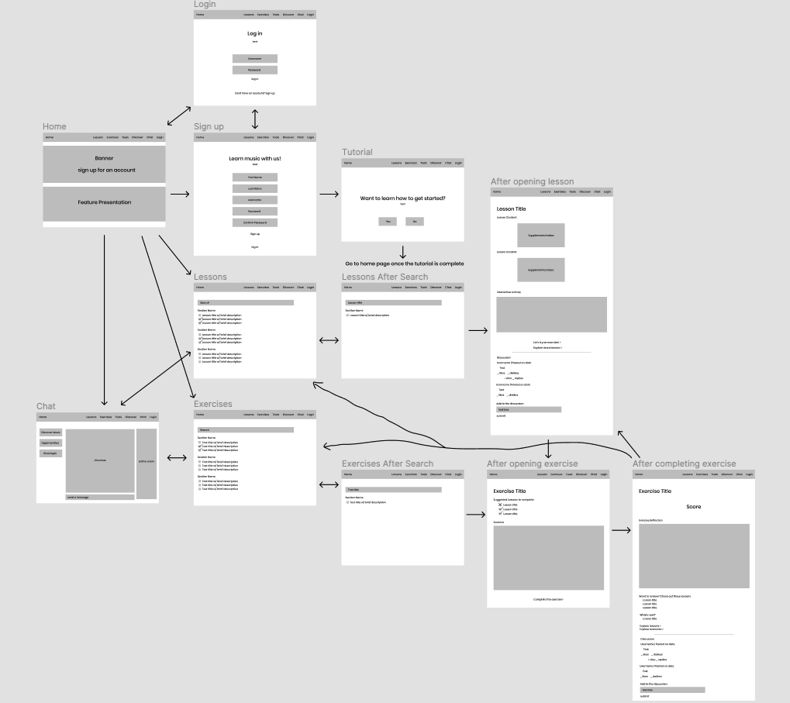

# Description 

## Purpose
The project aims to create a platform for better music learning experience. The purpose of creating a low fidelity prototype is to have a low-cost method to design and test the organization of a product. This is important because it allows for potential design problems to be uncovered and for users to voice their opinions before the final product is crafted.

## User Research
Based on research done through contextual inquiry, there are 3 features of focus:
- How to organize lessons in a way that is comprehensible and easy to people of all backgrounds to focus on what they want to learn.
- How to present information in a credible manner so that users can help each other learn and verify the information presented in the video
- How to create a platform where musicians can interact with one another and present opportunities for each other

## Personas 
For the sake of the product, 2 personas were created to better understand how users may interact with the product. These personas were created after interviewing users who are learning music.
1. Mark is a passionate math teacher who teaches high school students. In his free time, Mark has started picking up the guitar. He used to play piano but stopped once he graduated high school. He has some understanding of music theory but wants to refresh and deepen his understanding of it.  Currently, Mark is using Youtube to further his understanding but struggles with the wide variety of videos available. 
2. Kevin is a recent graduate student who pursued a computer science degree. Throughout his time as a student, Kevin pursued playing the saxophone and joined a student organization on campus focusing on bringing woodwind musicians together. Now that he’s graduated college, Kevin wants to continue to refresh his understanding of music theory and maintain a community of musicians he can learn with. Kevin is also interested in sharing his knowledge of music theory.

# Wireframes & Wireflows 

# Testing
## Tasks
1. Find a lesson and complete it through its entirety
2. Add a comment to a lesson and test discussion
3. Find a chatroom that talks about opportunities to practice music with others 

# Reflections
I learned a lot while creating the wireframe and wireflow. I tried to put myself in the user's shoes as I designed the necessary wireframes and constantly questioned how a user would go about using the website. I focused a lot more on functionality and if I were to redo the wireframes I would focus a little bit more on the aesthetics and making functionalities more clear. 

Overall, the testing went pretty smoothly. The user was able to navigate throughout the website with relative ease which was largely thanks to the tool bar at the top of the page. However, the user did point out some design flaws and questions that would have to be addressed in future iterations. For instance, though the user was able to find the chat rooms and thought navigating between different topics would be easy, they questioned why there should be a chatroom in the first place. They suggested making blog posts and focus on the discover portion (not wireframed) to encourage interaction between users. One problem with chat rooms is that opportunities and important messages can quickly be buried as more users interact. Another problem the tester pointed out was that it would be hard to continue older conversations or focus on a particular conversation while many people were talking. Utilizing blogposts with a specific topic would make things much cleaner and more organized while still fosering a community of users. There were also a few other concerns such as how a new user would know where to start as presenting a sheer list of lessons could be overwhelming. The tester also suggesting color coding or organizing the website better as there could be a lot of information presented on a page that a wireframe couldn't be able to reflect. Aesthetics is something that I would have to heavily consider in the next steps.
