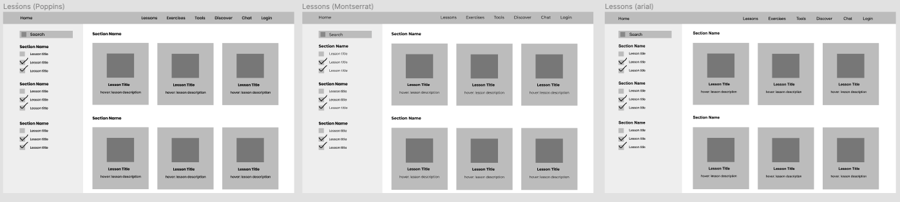
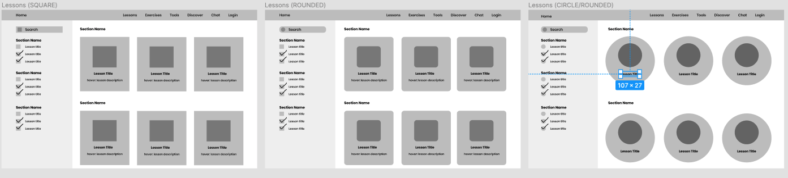
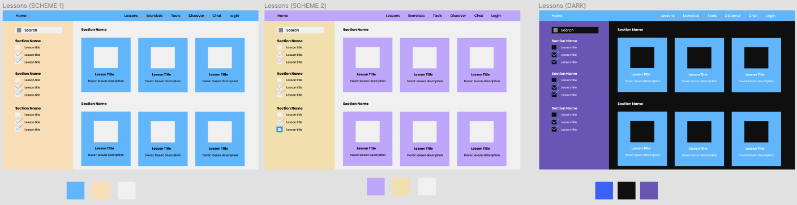

# Assignment 7

# Description
In this assignment, we are seeking to create a music theory learning application that is user friendly and provides a community for musicians to learn from each other. The interactive prototype was made to discover usability issues and audience opinions of our interface. Here are the following key tasks that are focused on:
1. User friendly for beginner musicians of all backgrounds
2. Provides a community for musicians to interact with one another
3. Provides a credible resource of information for music learning

# Purpose
Creating an interactive prototype has many benefits during the design process. First it helps designers visualize a task flow for the many different tasks and interfaces the users will be interacting with while using the product. Second, it helps designers create consistent design throughout the various areas of the application. Third, the interactive prototype can be used to test the usability of the product and measure user opinions of the design before it is implemented.

# Process
This interactive prototype was created using figma. Once the wireframe is digitized, I readjusted the original design to fit a body font size of 16. Then the frames were readjusted to fit the scale of a standard 1440 x 900px Macbook Pro screen size. After all the information was fit to scale, the typography, shapes, and color schemes were chosen and applied to the website. Since, we are creating a website for learning, all of the choices tested on the prototype were inspired by this fact.

# Figma link to digitized wireflow
https://www.figma.com/file/QgRjPGVoZWMCMZtnjEF8Ec/Assignment-6

# User Interface Design Variationtype
## Typography

The typography that was applied were poppins, montserrat, and arial. The original intent of the typography were to create a sense of seriousness, credibility, and focus while still maintaining a hint of fun. The font should not make the user question the legitimacy of the website nor should it distract the user from learning. Montserrat and arial definitely achieve this serious effect while remaining familiar to many users. Though a little less serious, the roundness of poppins adds a more casual aspect to the prototype. Out of the 3 choices, poppins is my font of choice.

## Shape

I wanted to test how the roundness of the objects would affect the overall feel of the website. While the edged shapes are a classic look, it makes the website feel less developed,dated, and boring, which may deter users from using the website. However, on the other end of the spectrum, the useage of circles adding too much childish energy to the website. Though we are trying to appeal to musicians of all ages and backgrounds, the circles may not appeal to older audiences. Overall, the rounded edges maintain a good compromise between the two extremes.

## Colors

Three different color schemes were developed in order to test out how colors would have an effect on the prototype. Blue and yellow were chosen for the first color scheme. Blue promotes a feeling of trust, loyalty, honesty, and reliability while yellow creates a sense of happiness and creativity. Both of these colors create effects that we wanted our learning audience to feel. Purple was tested for the second color scheme since it creates a sense of wisdom and inspiration. A dark color scheme was also created using black, blue, and purple. All colors were tested using the Adobe color contrast analyzer which can be accessed here: https://color.adobe.com/create/color-contrast-analyzer 

# Impression Test
A 5-second impression test was used to test what users took away from the design from a first glance. Here are some key points from the impressions that were quoted from the interviewers:
- "What page am I on, what am I looking at? You should include a header indicating that this is a lessons page at the top with bigger text.
- The page with colors definitely seems pretty youthful like I feel like people can tell it was made by someone who is younger. I dont know if you want to have that effect on older audiences? You might want to reconsider the effects of that."
- "I'm not very sure about the color choices. The yellow reminds me of Easter. Maybe choose colors that are more muted and darker. Like grayer tones? And have one tone that is the main focus I feel like the yellow banner on the side is distracting."

From their first impression, the users definitely obtained a sense of "youth" from the webpage and felt that it appealed to younger audiences. The color choices seemed to have contributed to this aspect a lot. Overall, the 5 second impression test left me with a lot of criticisms that need to be debated on to produce a better design. There are definitely changes that could be made to make this application more accessible to users, especially with the color choices. These points also helepd me learned a lot about what needs to be considered while designing the rest of the website. 

## Styleguide Summary
- Font Family: "Poppins"
- Header: 20px (subject to change)
- Body: 16px
- Button label: 16px
- Sub-title: 18px
- Line spacing: 1.5
- Shape roundness: 15
- Colors: to be reassigned after impression test.
