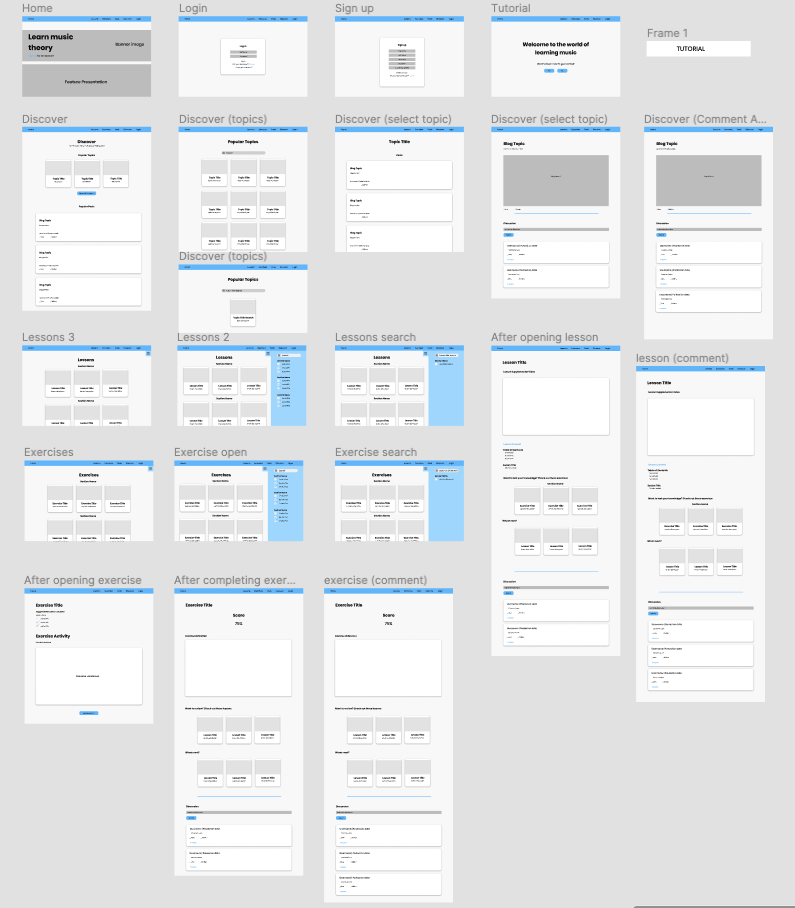
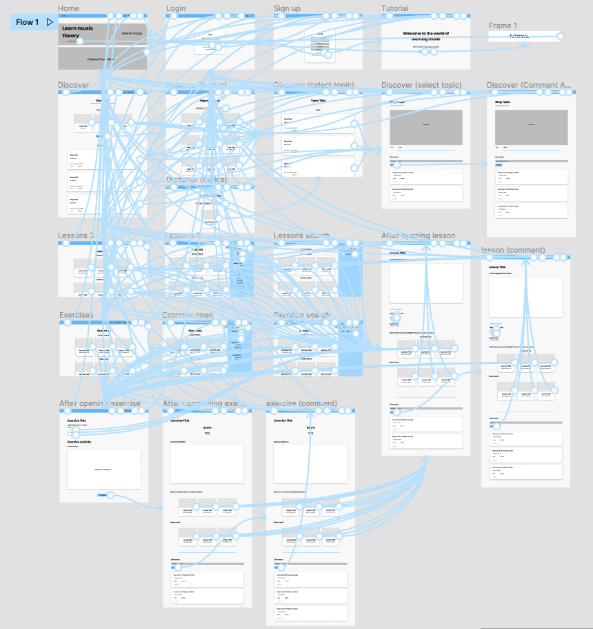

# Project Description 

## Purpose
In this assignment, an interactive prototype was created for a web app that enables people to learn music theory and connect with other musucians online. The purpose of this interactive prototype is to visualize the overall flow of the application, understand how user's make choices to navigate through the product, and better map out how the different functionalities of an application work with one another. 

## Process
The interactive prototype was created in Figma by utilizing the design and prototype functionalities. First, the wireframes were digitized and restructured to match the styleguide created in the previous assignment. However, graphic components, such as images, were not implemented as they were not essential to the interactive prototype. The final color scheme is mainly blue to promote a semse of credibility, responsibility, and wisdom. One the wireframes were digitized, the prototype functionality was used to create a flow of actions a user can take to interact with the product.

# Supported Tasks
1. User is able to engage in interactive lessons and exercises

One flow of action that the prototype illustrates is the user's ability to check out various lessons and exercises at their own convenience. First a user needs to select the "Lessons" or "Exercises" option in the top menu bar to view lessons or exercises respectively. The user can then search for a specific exercise or lesson and select it to enter into the interactive portion. Once the lesson is complete, they can check out other relevant lessons or exercises that are recommended to them. 

2. User is able to interact with others through blog posts and comments

Another flow of action that the prototype supports is the user's ability to add comments or blog posts so that their fellow musicians can interact with them. To add a comment, the user must complete either a lesson or exercise. Then at the bottom of the page, the user can find the discussion section and add a comment. To view blog posts, a user simply needs to select the "Discover" option in the top menu bar. Then, they can explore various topics and popular blog posts and select the one they want to contribute to.

3. User is able to log in or create an account

The user is able to log in or create an account in order to save their progress on lessons and exercises. Throughout the various pages, the web application will indicate to a user whether or not they have completed a lesson or exercise and save their progress. Thus, an account is needed to save this data. From the top menu bar or the home page, the user is able to sign in or create an account. 

# Wireflow Diagram

# Interactive Prototype

https://www.figma.com/proto/QgRjPGVoZWMCMZtnjEF8Ec/Assignment-6?node-id=20%3A2&scaling=min-zoom&page-id=0%3A1&starting-point-node-id=20%3A2

# In-class Cognitive Walkthrough
In class, a cognitive walkthrough was complete where classmates exchanged feedback on their products. Positive and negative feedback was received.

## Positive
My classmates commented on the usefulnes of the top menu bar that is always present throughout the web application. Each button corresponds to an important functionality that is central to the product. Since the menu bar is always present, users are able to escape to other sections of the webpage whenever they want. 

## Negative
One area of improvement that was pointed out was the usage of images and making the website more colorful. This could help add a layer of credibilty and make the product feel more put together. Another area of improvement was changing the names of the sections in the top menu bar. My classmates were confused what the "Discover" option meant from a first glance and state that it was very vague. This should be changed to something like "Blog" or "Posts" instead. 
