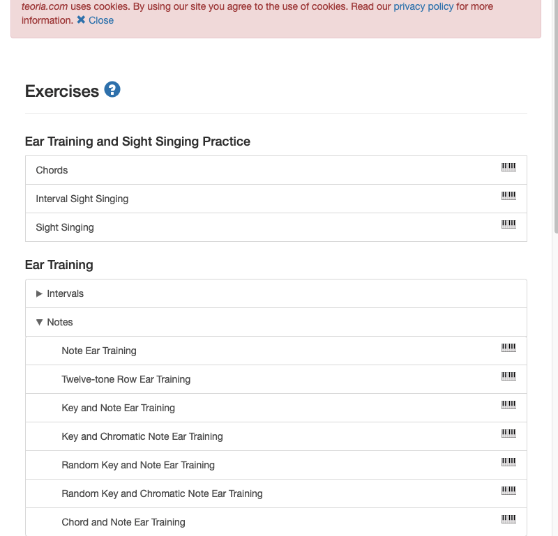

## Tentative title (of interest) of your project
Accessible Music Theory Learning for Middle-Aged Men

## Your name and course info
Katherine Chong | DH 110 | Spring 2022

## Description about the project how you want to contribute with your UX design
I want to contribute to these websites in order to learn how others practice good UX design and how to improve my own understanding by seeing where they fall short. I want to learn how to improve these designs for better user experience.

## Heuristic evaluation
1. Visibility of System Status = users should be informed about what's going on through feedback received within an acceptable amount of time
2. Match between systems and the real world = designers need to use words, phrases, and concepts familiar to users. Information should be presented in a natural and logical order
3. User control and freedom = users need an easy, clear way to escape unwanted actions 
4. Consistency and standards = designers should follow existing conventions; users should not have to figure out the meaning of words, situations, or actions
5. Error prevention = Eliminate conditions that lead to error or give users with confirmation before they perform an action
6. Recognition rather than recall = Make elements, actions, and options visible and easy to use
7. Flexibility and efficiency of use: Processes should be able to be done in multiple different ways
8. Aesthetic and minimalist design = only information that is relevant and needed should be added
9. Help users recognize, diagnose, and recover from errors = Error messages should be understandable, indicate the problem, and offer a solution
10. Help and documentation = when needed, provide extra documentation to help users understand how to complete their tasks

## Severity Ratings 
The following scale can be used to rate the severity of usability problems
0 = Not a usability problem
1 = Problem doesn't need to be fixed unless extra time is available
2 = Minor, low priority usability problem
3 = major usability problem. Fixing it is given high priority
4 = usability problem must be fixed before product is released 

## Website Analysis 

## Website #1: musictheory.net
Information: This is a website that lets people learn notes, chords, and scales for free. It offers lessons, exercises, and tools. There are three different services that this website offers: lessons, exercise, and tools. 

### Screenshots: 

### URL: https://www.musictheory.net/

### Overall Evaluation:
I thought that this website was relatively simple and easy to use. I struggled for a moment on the more intuitive functionalities (such as clicking through the lesson). The simple design of the website really spoke to me. In addition, the visual elements that change as you go through the lesson also appealed to me as a visual learner. Some of the functionalities offered by the website were a bit confusing but were easy to figure out through trial and error. I could see myself using this if I was interested in learning music theory more. 

### Heuristic Evaluation: 
#### Visibility of System Status
##### Does it follow it? why?
The website has a clear left and right button that lets you move onto the next portion of the lesson. The current step is highlighted so the user is informed of what happens when they move onto the next step. Nothing is done without the user not knowing or making it happen.
##### Does it break it? why? solution?
Users are given the option to listen to audio. However, this is only applicable to certain lines in the lesson. This can be confusing and misleading for users. Instead of including the audio option on all the lines, they can just add it for the lines that have that functionality. 
##### Severity rating = 3
#### Match between systems and the real world
##### Does it follow it? why?
The website follows conventions that are common across all websites. Familiar icons such as the forward arrow, audio symbol, home, etc can be found. Introduces new terms to users to promote understanding.
Severity rating = 0
User control and freedom 
Does it follow it? why?
Home button to return back to the list of lessons is always visible in the top left corner. Users can quit a lesson at any time. Users can return to a lesson at any time. 
##### Does it break it? why? solution?
It’s difficult for users to completely redo or retrace their steps. Process in the lesson is not saved if the user quits the lesson, which makes it inconvenient. A potential solution is for the website to save the users progress in case they leave the lesson and want to return back to where they were.
##### Severity rating = 2
#### Consistency and standards
##### Does it follow it? why?
The website uses universal symbols for actions (i.e. click on home to return to the lessons page). Users are able to enjoy consistent behaviors that are commonly found in other websites.
##### Does it break it? why? solution?
There is a new symbol (piano) that is never specified how it is used. Upon clicking, a piano is brought up in another tab. The website could educate its new users through a tutorial that specifies what this unfamiliar symbol refers to. Furthermore, the audio symbol is a bit misleading; instead of reading out the lesson line, it plays a musical note. This can be fixed through a small tutorial.
##### Severity rating = 3
#### Error prevention
##### Does it break it? why? solution?
The website does not warn users that progress will not be saved once they leave the lesson. They could solve this by providing a quick tutorial for new users or having a pop-up that asks if they are sure they want to leave. 
##### Severity rating = 2
#### Recognition rather than recall
##### Does it follow it? why?
Different steps a user can take are recognizable in the form of icons. There aren’t too many steps a user can take at one time so there is no need for users to memorize steps.
##### Does it break it? why? solution?
It is hard for users to move from different lesson types from a lesson. They may have to recall how to access different lesson lists. They also offer no context for how a user can navigate through their lessons, which means that users need to recall their own knowledge to guess how the product works. They could circumvent this by either providing a quick tutorial for beginners or have a bar at the top that enables users to move from different lesson types from a lesson.
##### Severity rating = 3
#### Flexibility and efficiency of use
##### Does it follow it? why?
There are multiple ways to navigate through a lesson. Users can click on sections or use the arrow buttons at the bottom. 
##### Does it break it? why? solution?
There are no multiple ways to navigate through the website. However this is not too much of an issue since the functionality is not that complex. The website can add additional functionality (such as using the keyboard to implement shortcuts) 
##### Severity rating = 0
#### Aesthetic and minimalist design
##### Does it follow it? why?
There is no unnecessary information presented. Lessons are very clear and there are minimal distractions. 
##### Severity rating = 0
#### Help users recognize, diagnose, and recover from errors
##### Does it break it? why? solution?
When users make errors on the lesson, it simply marks the wrong option as red. It doesn't indicate that the user can keep going or how to recover from this. Could be solved with a quick tutorial for new users.
##### Severity rating = 1
Help and documentation
##### Does it follow it? why?
The website offers a contact us option that leads users to a FAQ or write an email.
###### Severity rating = 0

## Website #2: teoria.com

### Information: This is a website that lets people learn notes, chords, and scales. It offers tutorials and exercises that users can use to learn music.

### Screenshots: 

### URL: https://www.teoria.com/

### Overall Evaluation:
My first impression of Teoria was that it was a simple, easy to use website to learn about the basics in music theory. I liked the visual and audio elements of learning through videos in each lesson. However, I felt like it could be more aesthetically pleasing to help boost its credibility and make learning a more enjoyable experience.

### Heuristic Evaluation: 
#### Visibility of System Status
##### Does it follow it? why?
The website operates solely on responding to what the user clicks. The user is always informed about what is going on since they have to initiate it.
##### Severity rating = 0
#### Match between systems and the real world
##### Does it follow it? why?
The website follows conventions that are common across all websites. Familiar icons such as the forward arrow and menu can be found. Introduces new terms to users to promote understanding.
##### Severity rating = 0
#### User control and freedom 
##### Does it follow it? why?
There are back buttons that let you undo an action. Users are free to return to a previous lesson or back to any lesson list.
##### Severity rating = 0
#### Consistency and standards
##### Does it follow it? why?
The website uses universal symbols for actions. Users are able to enjoy consistent behaviors that are commonly found in other websites
##### Does it break it? why? solution?
The menu symbol is a little unfamiliar with the way it is used. It returns back to the list of lessons rather than opening up a menu. This can be fixed by removing the symbol and saying “Back to Tutorials” to avoid miscommunication.
##### Severity rating = 2
#### Error prevention
##### Does it break it? why? solution?
Similarly to the other website, this website does not warn users that progress will not be saved once they leave the lesson. They could solve this by providing a quick tutorial for new users or having a pop-up that asks if they are sure they want to leave. Otherwise, there not any other errors that can be produced.
##### Severity rating = 2
#### Recognition rather than recall
##### Does it follow it? why?
Different steps a user can take are recognizable in the form of icons.
##### Does it break it? why? solution?
There are many different windows that the users need to navigate to get back to a place they were once in. This can be fixed by optimizing the path and reducing the amount of new windows a user goes into. Therefore, the user would have to remember less.
##### Severity rating = 3
#### Flexibility and efficiency of use
##### Does it break it? why? solution?
There aren’t multiple ways to do things (such as access a lesson). The website needs to enable more flexibility and efficiency for experienced users. This could be done by having a more complex menu system but this may deter new users. Therefore, a small tutorial should be implemented for the new users.
##### Severity rating = 3
#### Aesthetic and minimalist design
##### Does it follow it? why?
Overall, the website design is pretty simple. There is not much additional information given.
##### Does it break it? why? solution?
There are ads that are at the bottom of each lesson and pop-ups that may occur, which is distracting additional information. However, if the website needs these websites to produce revenue to allow it to stay on the website, there’s not much they can do to fix this issue 
##### Severity rating = 2
#### Help users recognize, diagnose, and recover from errors
##### Does it break it? why? solution?
The website doesn't warn users of ads or errors, which may be confusing for some to navigate. 
##### Severity rating = 2
#### Help and documentation
##### Does it follow it? why?
The website offers a help button on the menu bar.
##### Does it break it? why? solution?
Though a help option is listed, there is no way to directly contact people who have worked on the product. This can be fixed by adding a section to fill out and send an email.
##### Severity rating = 2

